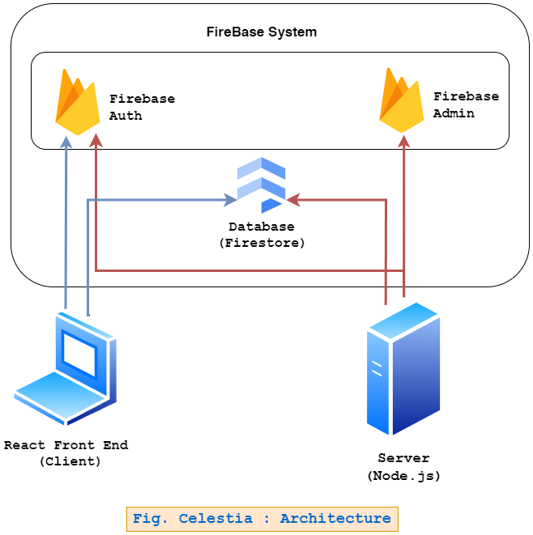

# 🌌 Celestia - Cruise Ship Management System  

Welcome to **Celestia**, an all-in-one cruise ship management system designed to improve the onboard experience for voyagers and streamline operational workflows for staff. Built with **React**, **Express**, and **Firebase**, Celestia offers seamless automation and an intuitive interface for managing reservations, orders, and facility usage.  

---

## 🏛️ System Architecture  

Below is the architecture of Celestia, designed for efficient communication between the front end, back end, and database:  

  

---

## Deployed Site Access

Access the already deployed site at : https://celestia-cruise-ship-management-service.vercel.app

## 🌟 Features  

### Voyager Module  
- **Order Services**:  
  - Place orders for catering, beauty salon reservations, party halls, fitness centers, and movie tickets.  
- **View Own Orders**:  
  - Access and manage personal cart and orders.  

### Guest User Module  
- **View Services**:  
  - Explore all services available on the cruise.  
- **Restricted Access**:  
  - Cannot place orders or add items to the cart.  
  - Must wait for admin approval to be assigned a role.  

### Admin Module  
- **User Management**:  
  - View all awaiting guests and approve them by assigning appropriate roles (Voyager, Manager, Supervisor, etc.).  
- **Service Management**:  
  - Add new items and update or delete existing ones.  
- **Cart and Order View**:  
  - Monitor his own bookings and orders(as user).  

### Manager Module  
- **View Orders Across Services**:  
  - Access and track bookings for:  
    - Resorts  
    - Movie tickets  
    - Beauty salons  
    - Fitness centers  
    - Party halls
- **Cart and Order View**:  
  - Monitor his own bookings and orders(as user).    

### Head-Cook Module  
- **Manage Catering Orders**:  
  - View and fulfill all catering-related orders.
- **Cart and Order View**:  
  - Monitor his own bookings and orders(as user).  

### Supervisor Module  
- **Manage Facility and Stationery Orders**:  
  - View and fulfill orders specific to their assigned department.  
  - Handle requests for stationery and other supplies.
- **Cart and Order View**:  
  - Monitor his own bookings and orders(as user).    

---

## 🛠️ Tech Stack  

### Frontend  
- **React**: For building a responsive, interactive UI.  
- **Tailwind CSS**: For sleek and modern styling.  
- **React Router**: For seamless navigation.  

### Backend  
- **Express**: A Node.js web application framework for handling backend APIs.  
- **Firebase Firestore**: Cloud-based database for real-time data management.  
- **Firebase Authentication**: Secure user authentication.  

### Additional Tools  
- **React Context API**: Manage global state efficiently.  
- **Firebase Hosting**: Host the application securely and scalably.  

---

## 🎯 Key Functionalities  

1. **Role-Based Permissions**:  
   - Guests can view services but cannot place orders until approved by Admin.  
   - Voyagers can view and place orders for all services.  
   - Roles such as Head-Cook, Supervisor, Manager, and Admin inherit Voyager permissions and have additional capabilities based on their role.  
   - Each role has their own cart and order system to manage personal needs.  

2. **Real-Time Updates**:  
   - Firestore ensures instant updates for all user actions like reservations and order tracking.  

3. **Admin Flexibility**:  
   - Full control over user approvals, role assignments, and service management.  

4. **Responsive Design**:  
   - Optimized for all devices, from desktop to mobile.  

---

